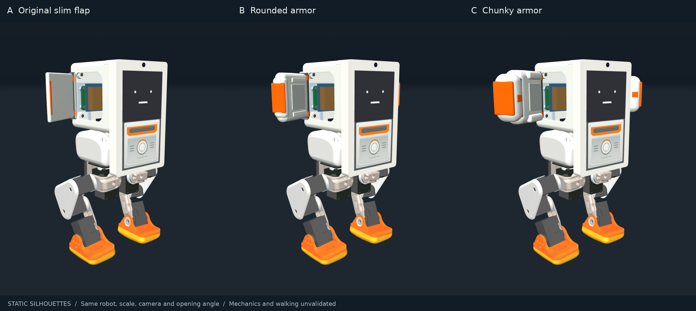

# MicroDuck × ｽﾀｯｸﾁｬﾝ / Tab5

縦置き M5Stack Tab5 と MicroDuck の脚を組み合わせる、機械形状・歩容学習・ブラウザーシミュレーターの実験プロジェクトです。

**採用する外観は薄型フラップ腕（初回④ / 比較A）です。学習済み歩容とWebの物理モデルは腕なし・736.537 gの検証済み基準機を維持しています。** 腕付き歩行の学習・検証はまだ行っていません。



## まず試す

- [ブラウザーシミュレーター](https://meganetaaan.github.io/microduck-stackchan/)：MuJoCo WASM + ONNX、サーバー側の物理計算なし
- [採用した薄型腕のモデルと設計上の制限](design/arms/README.md)
- [歩容・学習済み方策・評価結果](training/tab5_gaits/README.md)
- [アセンブリと暫定BOM](README-ASSEMBLY-UART-ja.md)

Webをローカルで動かすには Node.js 24、Python 3 を用意します。

```sh
cd web
npm ci
npm run build
python3 -m http.server 8000 --directory dist
```

ブラウザーで `http://localhost:8000` を開いてください。WASMとWorkerを使うため `index.html` の直接ダブルクリックでは動作しません。初回は約56 MBを読み込みます。

操作は開始/一時停止、リセット、WASDまたは矢印、Q/Eで旋回。ジョイスティックとボタンにも対応し、Spaceや入力解除で静止指令へ戻ります。操作と検証の詳細は [web/README.md](web/README.md) を参照してください。

## 収録内容

| 場所 | 内容 |
|---|---|
| `prototype/assembly_uart/` | 現在の腕なし縦型UARTアセンブリ、light/heavy、部品メッシュ、生成・検証ソース |
| `prototype/assembly_uart/screen_visual/` | 同じ物理特性を維持した画面付き表示派生 |
| `design/arms/` | 採用した薄い④/A、他の比較案、MJCF・GLB・画像・再生成ソース |
| `training/tab5_gaits/` | 39観測/10出力ONNX、チェックポイント、PPO・評価ソース、試行結果、動画 |
| `web/` | 静的Webアプリ、MuJoCo/BAM/ONNX推論、数値比較、操作の回帰試験 |
| `prototype/portrait*`, `prototype/rounded/`, `prototype/models/` | 保存した旧形状と試験記録 |
| `docs/` | BOM、設計仮定、過去の文書と公開時の変更記録 |

旧版のREADME内にある「未学習」「再学習なし」「ZIPに別添」等は、その時点の記録です。このGitリポジトリにはアセンブリと学習成果を統合しています。元の公開プロジェクト全体を複製せず、必要な上流ソースはコミットを固定して取得します。

## 学習済み歩容の範囲

- 静止、低速前進、前進、後退、左右移動、左右旋回の8指令
- 元のMicroDuck方策を初期値に、768,000 PPO制御ステップと105,600校正ステップ
- 保存済みnative評価：定常112/112試行、60秒切替5/5試行が定義した速度・姿勢基準を通過
- 転倒・胴体と脚の接触は保存済み評価で0。実機の安全性や精密な経路追従の保証ではありません
- 後退では20秒後の横ずれが基準機で最大0.367 m、変動条件で最大0.722 m残ります

腕の質量・慣性・衝突、実サーボと取付、配線・強度・印刷性を確定した後、腕付き物理モデルを作り直して再学習・再評価する必要があります。腕の静止MJCFは無質量・非接触の描画用で、歩行性能の評価には使用できません。

SIT/FOLD、座り立ち、脚の折り畳み、転倒復帰、ローラー、実機接続は、この学習済み方策の対象外です。電源・保護・停止方式を含むハードウェア仕様は暫定です。

## native再現

Python 3.12 / MuJoCo 3.10.0を使用したCPUベースの再現手順です。初回bootstrapは上流ソース・方策とPython依存をネットから取得し、保存済みモデルを再生成します。既存のモデルを残す場合は新しいクローンで実行してください。

```sh
bash bootstrap_assembly_uart.sh
.venv/bin/python -m pip install -r training/tab5_gaits/requirements.txt
.venv/bin/python training/tab5_gaits/verify_results.py
```

評価・学習の詳細コマンドは [学習README](training/tab5_gaits/README.md#実行配置と再現) を参照してください。現在の公開作業で追加学習や有料計算は行っていません。

## 検証の読み方

`training/` の数値結果は保存済みnative試験です。`web/test-results/` はWeb移植の数値・入力試験で、試験環境と実行済み/未実行の境界を各結果に記録しています。公開時の再検証と変更は [公開記録](docs/PUBLICATION.md) にまとめています。

## ライセンス

**ソフトウェア・方策と3Dモデルではライセンスが異なります。**

- プロジェクトのソフトウェアと改変方策：Apache-2.0
- MicroDuck由来の3Dモデル・派生形状：上流の表記は「Creative Commons BY-SA-NC」。調査した上流文書にバージョン番号がないため、勝手に4.0等へ読み替えていません。非商用・表示・継承条件を保持します
- MuJoCo、ONNX Runtime、Three.js、Lucide等：各上流ライセンスと同梱告知

[LICENSE.md](LICENSE.md)、[MODEL-LICENSE.md](MODEL-LICENSE.md)、[NOTICE.md](NOTICE.md)、[LICENSES/](LICENSES/) を確認してください。Pollen Robotics、M5Stack、Radxa、ROBOTIS等の公式製品・認定設計ではありません。
